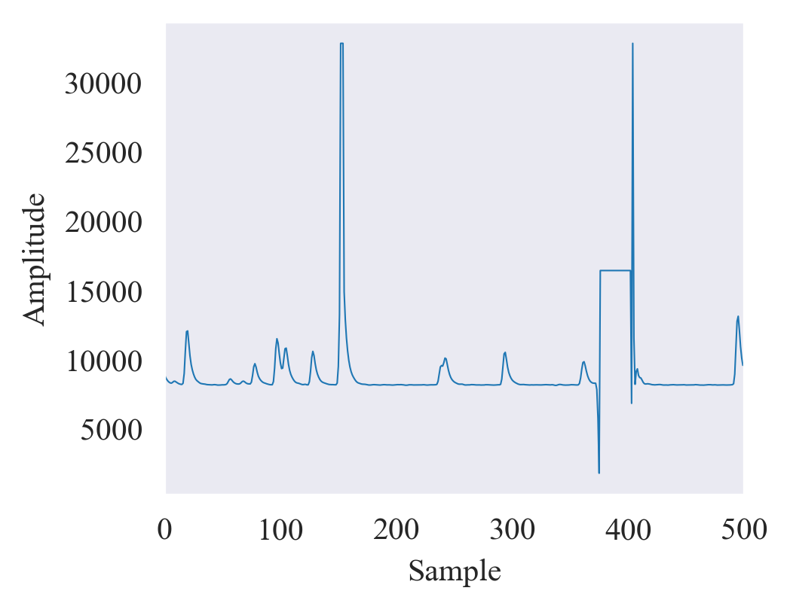
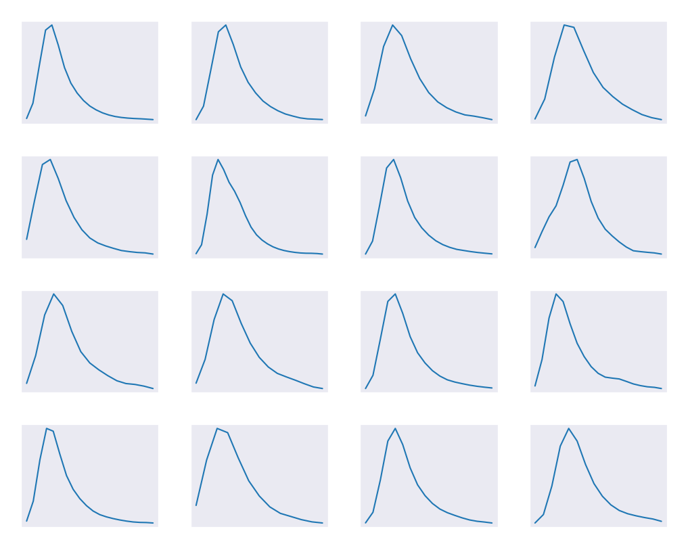
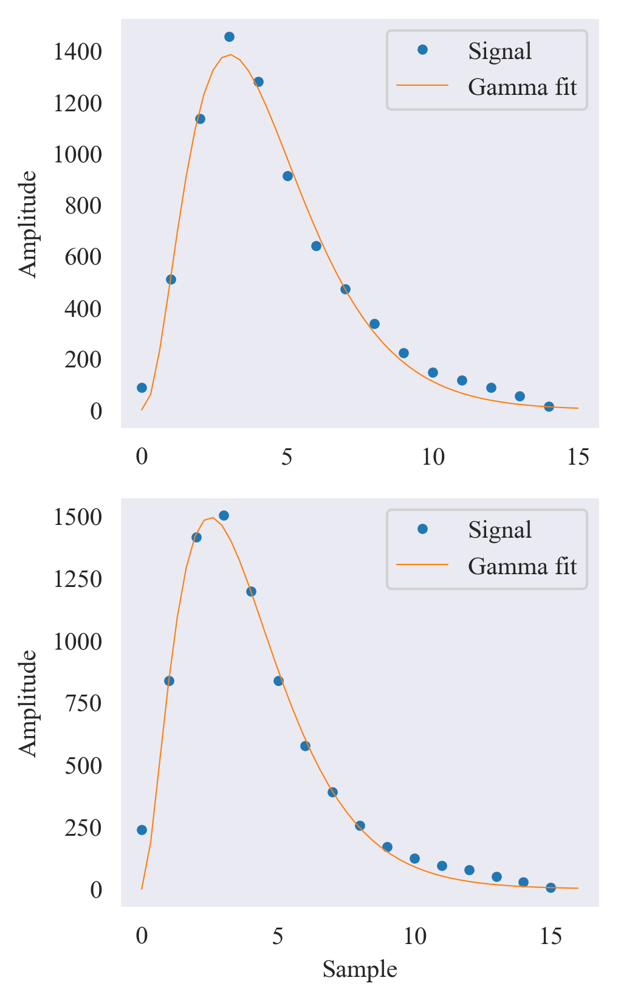
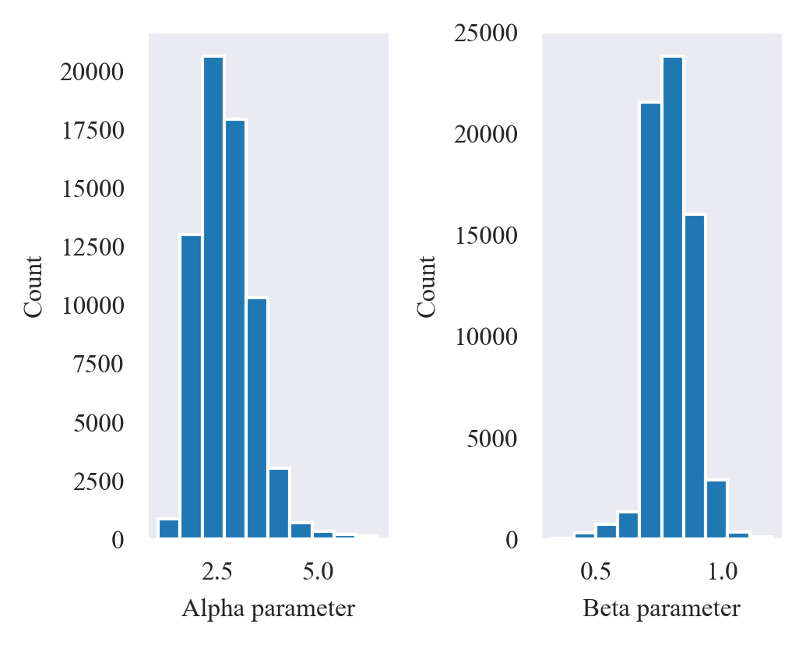
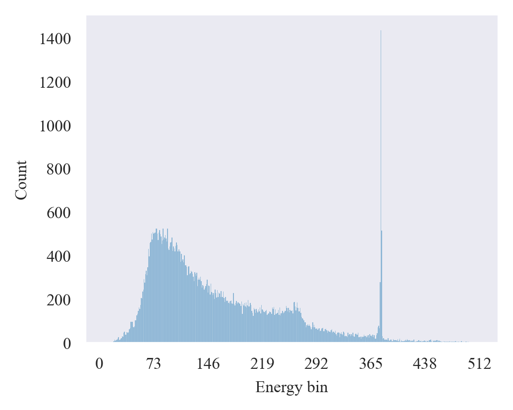
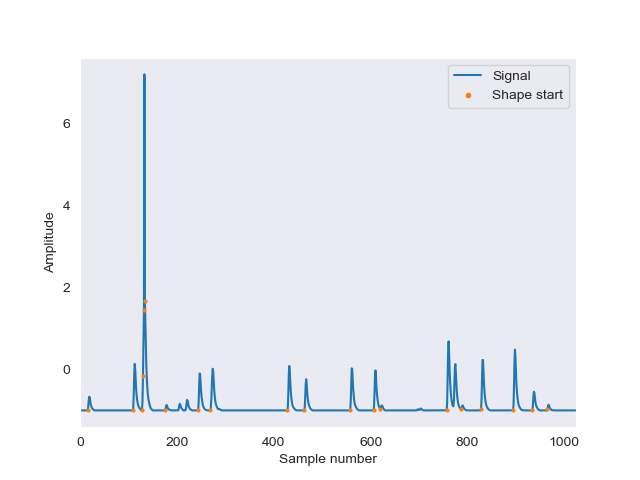

### Deep Learning Based Method for Activity Estimation from Short-Duration Gamma Spectroscopy Recordings

This is the supplementary material for the paper "Deep Learning Based Method for Activity Estimation from Short-Duration Gamma Spectroscopy Recordings" by D. Bykhovsky and T. Trigano.
The paper is currently under review.

This repository contains the two main parts of the project:

1. The code for the extraction of the signal parameters from the gamma spectroscopy measurement signal.
2. The code for the training of the deep learning model for the activity estimation.

### Signal parameters extraction

The goal of signal parameters extraction is to provide a simulation that reflects the properties of the experimentally measured signal.

#### Signal description

The signal is a raw HPGe measurement signal. The signal is 1 second long and has a sampling frequency of 10MHz. The signal is sampled by a 16-bit resolution A/D converter and is stored in `unit16` format. For convenience, the file is stored in Matlab's `mat` format. The excerpt of a signal is presented below. The plot illustrates a few essential characteristics of the signal:

* Bias level
* Example of a saturated peak
* Example of a detector's dead time.

#### Signal pre-processing

The signal pre-processing in [signal_analysis.ipynb](signal_analysis_example/signal_analysis.ipynb) includes the following steps.

##### Bias removal

The bias was approximated by a threshold level that is slightly higher than the median value. All the values below the threshold were zeroed.

##### Pulse shapes segmentation

The pulse shapes were segmented by identification of up and down signal properties. Then, all the resulting segments were converted to `float` and stored for further processing. About $1.5\times 10^5$ segments were identified.

##### Remove saturated shapes

The saturation level corresponds to the highest value represented by `unit16` format. All the segments (about 4,000) with the highest possible values were removed.

##### Remove low-amplitude segments

* The segments with the peak amplitude below the predefined threshold were considered as noise and removed.
* Remove segments with too high and too low energies
* Remove too short-length segments
* Pile-up rejection of segments with more than one peak
* Remove segments where the maximum is in the second half of the segment that they are physically incorrect (only a few of these are present in the signal)

##### Summary

The resulting signal is presented below.

#### Fitting

* All the segments were fitted with gamma shape MSE fit. The fitting examples are presented below. Note fitting takes a few minutes to run.

* Fitting results clean-up: The segments with abnormally high-cost function values and outliers of $\alpha$ and $\beta$ were removed.
* The resulting distribution of the fitted $\alpha$ and $\beta$ parameters is stored for further simulation and is presented below.

* The resulting energy histogram for 512 is stored for further simulation and is presented below.

The details of the code are provided in the [signal_analysis_example](/signal_analysis_example) directory.

### Deep learning model

The corresponding code is provided in the [gamma_sym_performance](/gamma_sym_performance) directory:

* [gamma_simulator.py](/gamma_sym_performance/gamma_simulator.py) - the script for the simulation of the gamma spectroscopy measurements.
* [create_dataset.py](/gamma_sym_performance/create_dataset.py) - the script for the creation of the dataset from the simulated gamma spectroscopy measurements.
* [train_model.py](/gamma_sym_performance/train_model.py) - the script for the training of the deep learning model.
* [test_model_exp.ipynb](/gamma_sym_performance/test_model_exp.ipynb) - the Jupyter notebook for the testing of the trained model on the experimental data into the [signal.mat](/gamma_sym_performance/signal.mat) file.

An example of activity mapping is presented below.

*Disclaimer*:
It should be noted that the code contains preliminary results for adapting the simulation to actual measurements. Further work is required to improve the similarity of the simulated signal to the experimental one.
